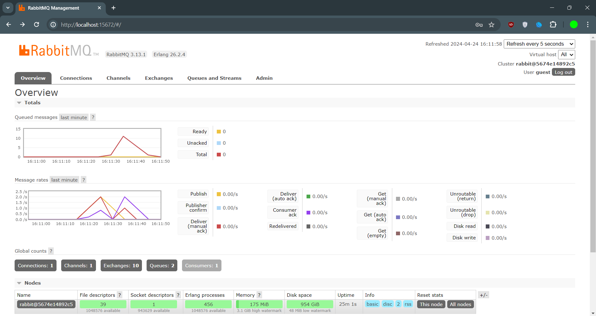
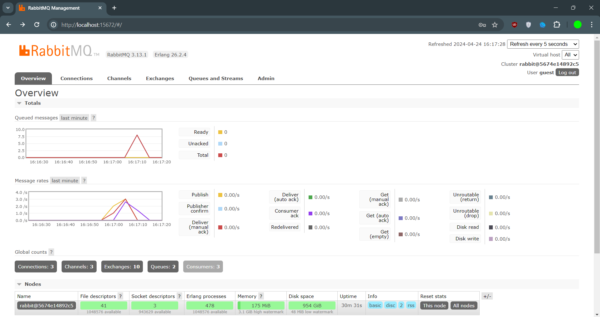

# tutorial-8-subscriber

# what is amqp?

AMQP stands for Advanced Message Queuing Protocol. It is an open standard application layer protocol for message-oriented middleware, which is used for passing business messages between applications or organizations.
AMQP defines a set of rules and behaviors that enable messaging providers (like RabbitMQ) to communicate with messaging clients (like the publisher and subscriber in this tutorial). It provides a standardized way for these components to interact and exchange messages, ensuring interoperability between different platforms and languages.

# what it means? guest:guest@localhost:5672 , what is the first quest, and what is the second guest, and what is localhost:5672 is for?

The string "guest:guest@localhost:5672" is the connection URI (Uniform Resource Identifier) used to connect to the RabbitMQ message broker.

- The first "guest" is the username for authentication with RabbitMQ.
- The second "guest" is the password for authentication with RabbitMQ.
- "localhost" refers to the hostname or IP address where RabbitMQ is running. In this case, it's running on the same machine as the publisher and subscriber (hence "localhost").
- "5672" is the port number on which RabbitMQ is listening for AMQP connections.

So, this URI tells the publisher and subscriber to connect to the RabbitMQ server running locally on the same machine, using the default guest username and password, and communicating over the standard AMQP port (5672).

# RabbitMQ's Graph

When I run the publisher repeatedly (by running cargo run multiple times in the publisher directory), it keeps sending events to the queue. However, since the subscriber is artificially slowed down, it cannot process the events as quickly as they are being published.
This is because the subscriber could not process the events as quickly as they were being published, leading to a buildup of events in the queue.

Running multiple subscriber consoles (three or more) allows for concurrent and parallel processing of messages from the queue, leading to faster queue clearance and a more responsive and scalable event-driven system.
